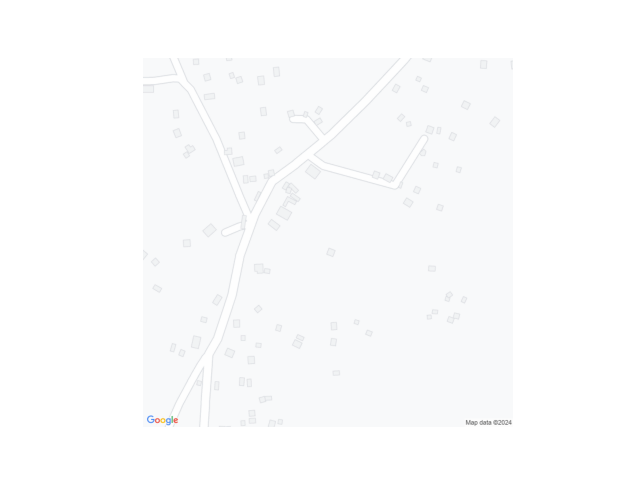
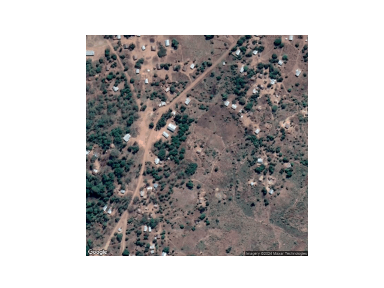

# Welcome to Counting Houses

## Introduction
Here we automatically count how many people live in an area in Malawi using Google Maps.
Quickly knowing how many people live in an area is important in various circumstances, e.g. distributing medicine
or providing help after a natural disaster. But if the area is remote this is not always known. The imagery
of Google Maps (houses) can be a useful source to quickly get an estimate from a distance. 

We first thought we needed to use satellite imagery, but it turns out we can use the map information of the Google Maps API, which already has houses detected pretty accurately for Malawi
(see darkgrey squares in map below). 
We then use the estimate of 4.3 people per house (specific to Malawi) to count the number of people
within a given set of coordinates. 
**We estimate 499 people live in the example area below.** 


based on the satellite imagery below




## How to run
`python entrypoint.py` (once you've completed setup below)


## Setup
### Python environment
```commandline
conda create --name counting-houses python==3.11 -y
conda activate counting-houses
pip install poetry
poetry install
```

### Google maps API connection
1. Go to the Google Cloud Console.
2. Click on "Select a project" and then "New Project".
3. Enter the project name and billing account, then click "Create".
4. Navigate to the "API & Services" > "Library" in the Google Cloud Console.
5. Search for and enable Maps Static API
6. Go to "API & Services" > "Credentials".
7. Click "Create Credentials" and select "API Key".
8. Copy the API key that is generated into a txt file and call it `credentials.txt`. 

# Contributors
Koen Greuell & [Clara Tump](https://github.com/clara2911)
