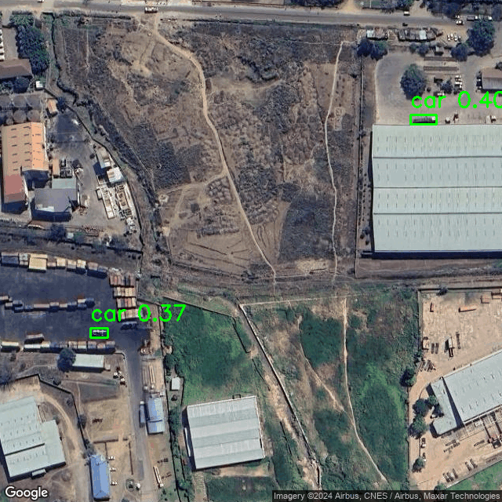

# Welcome to Counting Houses

## Introduction
Counting how many people live in an area in Malawi using Google Maps.
In Malawi officials do not have exact records of this, while it is useful to know for e.g. health reasons.
If counting automatically instead of by hand would be reliable enough, that would save a lot of time. 

Note that detecting African houses brings challenges for models which are pretrained on (often) US or European data.
Out of the box detection of a 'car' is apparently easier than a 'house' (yolov5 small - pretrained - standard hyperparameters)




## How to run
`python entrypoint.py` (once you've completed setup below)


## Setup
### Python environment
```commandline
conda create --name counting-houses python==3.11 -y
conda activate counting-houses
pip install poetry
poetry install
```

### Google maps API connection
1. Go to the Google Cloud Console.
2. Click on "Select a project" and then "New Project".
3. Enter the project name and billing account, then click "Create".
4. Navigate to the "API & Services" > "Library" in the Google Cloud Console.
5. Search for and enable Maps Static API
6. Go to "API & Services" > "Credentials".
7. Click "Create Credentials" and select "API Key".
8. Copy the API key that is generated into a txt file and call it `credentials.txt`. 

# Contributors
Koen Greuell & [Clara Tump](https://github.com/clara2911)
